# TDDE15 - Advanced Machine Learning Labs and Exams

This repository contains a collection of lab exercises and exams from the **TDDE15: Advanced Machine Learning** course taking at Linköping Univerity during the fall 2024. The main topics are: Bayesian Networks, Hidden Markov Models, Q-learning, REINFORCE, and Gaussian Processes.

---

## Lab 1: Bayesian Networks

1. **Hill-Climbing Variability**  
   - Show that different parameter settings yield non-equivalent Bayesian Network (BN) structures.

2. **BN Classification**  
   - Train a BN on 80% of the Asia dataset and classify `S` in the remaining 20%.

3. **Markov Blanket Classification**  
   - Classify `S` using only its Markov blanket.

4. **Naive Bayes Classifier**  
   - Construct a naive Bayes BN by hand and classify `S`.

5. **Analysis**  
   - Compare and explain differences across models.

---

## Lab 2: Hidden Markov Model for Robot Navigation

1. **Build HMM**  
   - Define an HMM based on the robot’s movement and observation model.

2. **Simulate HMM**  
   - Run a 100-step simulation.

3. **Path Estimations**  
   - Compute filtered, smoothed, and Viterbi paths from observations.

4. **Accuracy**  
   - Calculate accuracy of filtered, smoothed, and Viterbi paths.

5. **Repeat with Variability**  
   - Demonstrate advantages of smoothed distributions over filtered and Viterbi.

6. **Entropy Analysis**  
   - Calculate entropy over time to check localization accuracy.
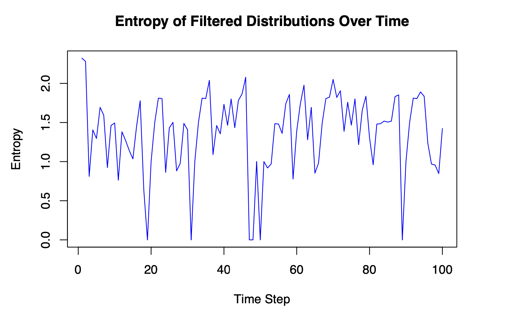

7. **Predict Next State**  
   - Estimate hidden state probabilities for time step 101.

---

## Lab 3: Q-Learning and REINFORCE

1. **Q-Learning in Grid World**  
   - Implement Q-learning, ε-greedy policy, and run 10,000 episodes.

2. **Environment A**  
   - Analyze learning with multiple rewards and observe optimal policy formation.
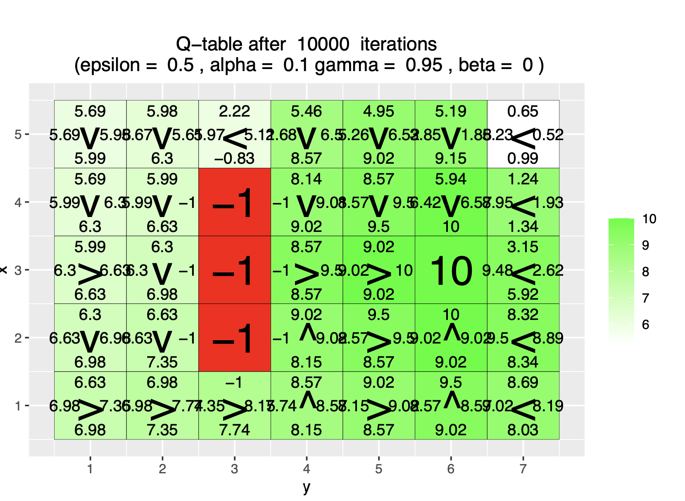
3. **Environment B**  
   - Examine how ε and γ affect the agent’s policy in a 7×8 grid.
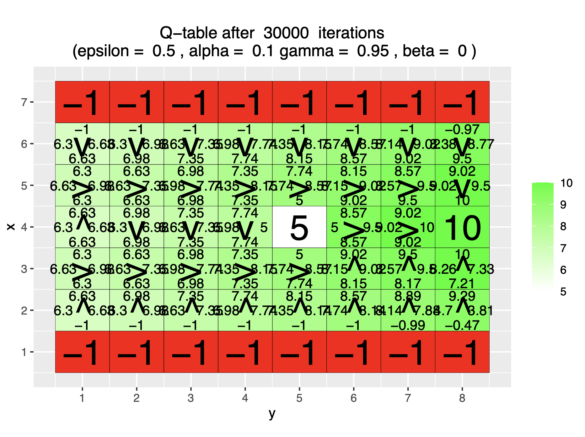
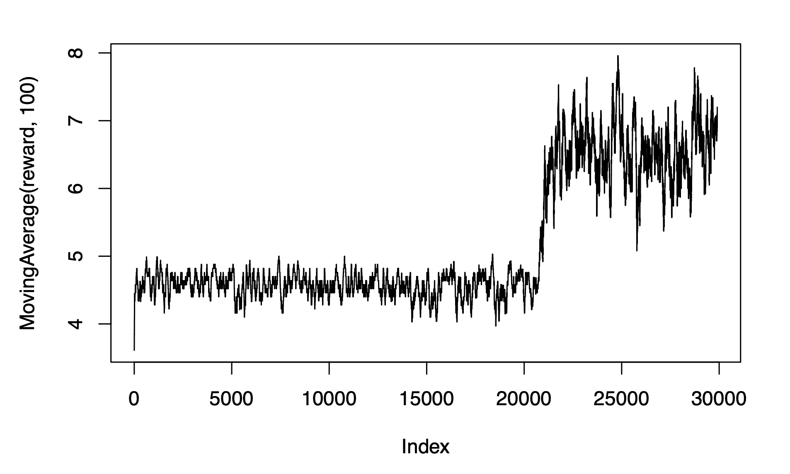
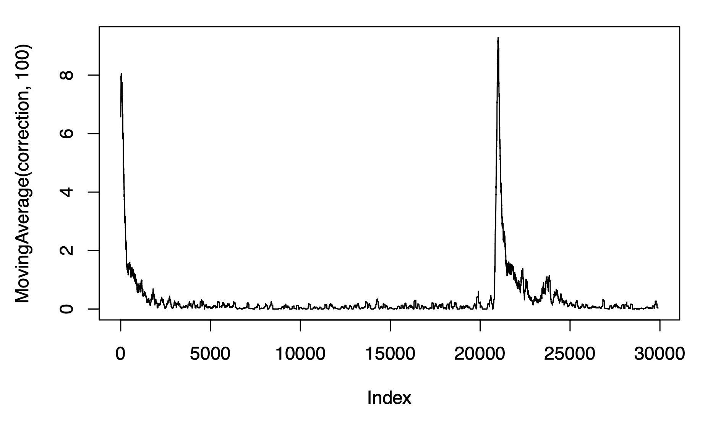
4. **Environment C**  
   - Study the impact of β on policy in a 3×6 grid.
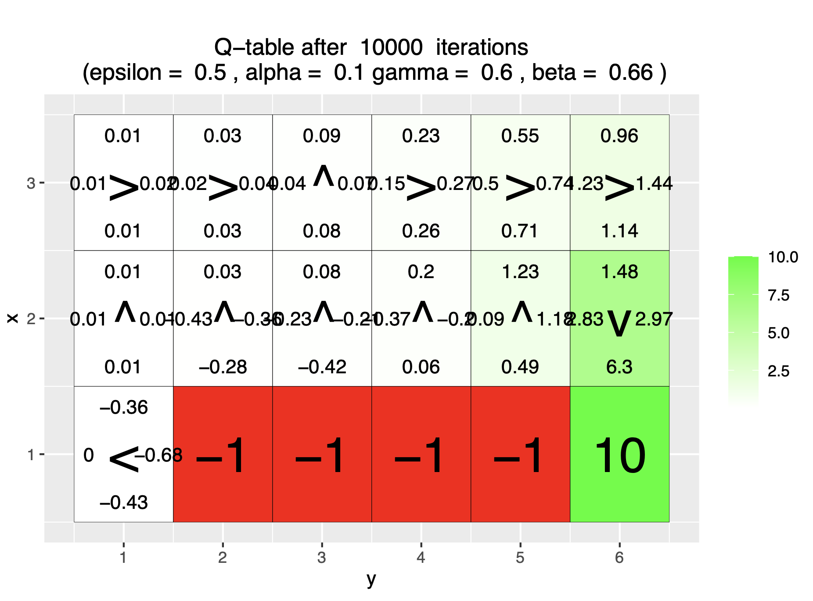
5. **REINFORCE in Grid World**  
   - Understand the REINFORCE algorithm’s operation in a 4×4 grid with random goals.

6. **Environment D**  
   - Validate policy learned with eight goal positions.
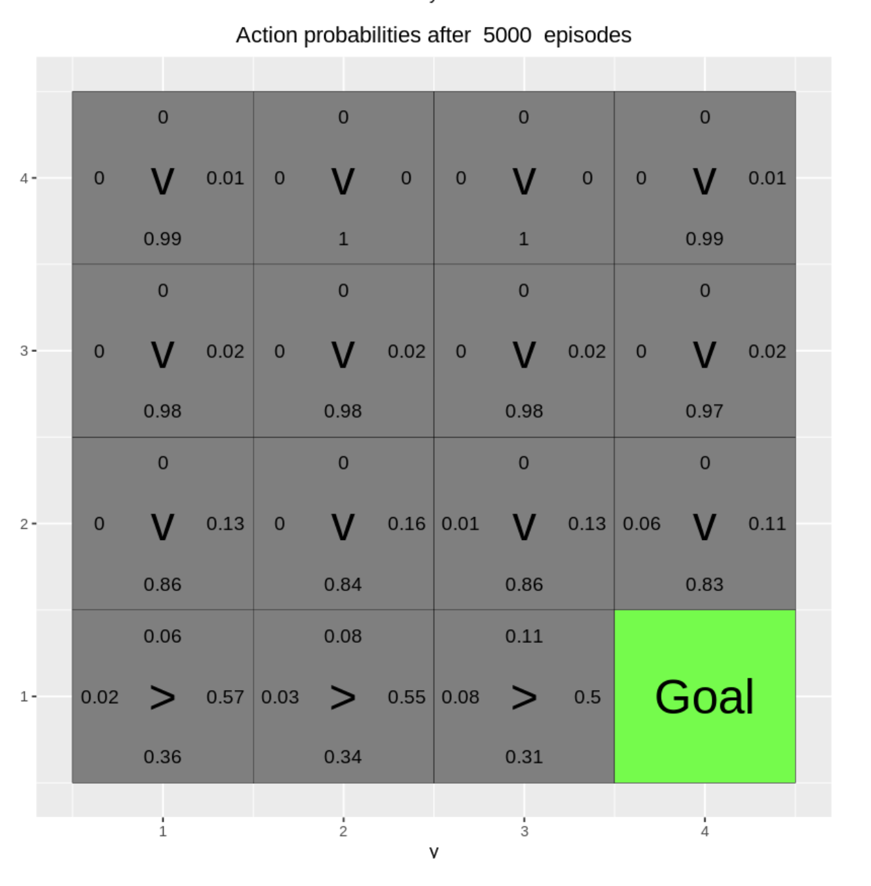
7. **Environment E**  
   - Analyze overfitting with goals restricted to top-row training positions.

---

## Lab 4: Gaussian Processes (GP) and Classification

1. **GP Regression Implementation**  
   - Implement GP regression using the squared exponential kernel.

2. **Posterior Updates**  
   - Update the posterior with single and multiple observations and visualize results.
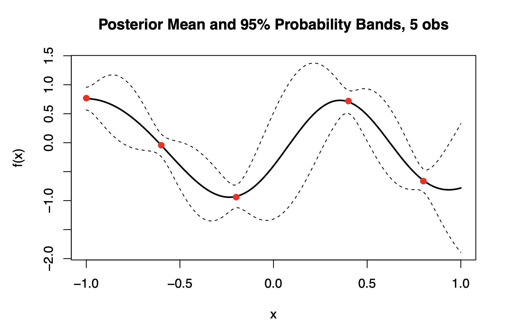
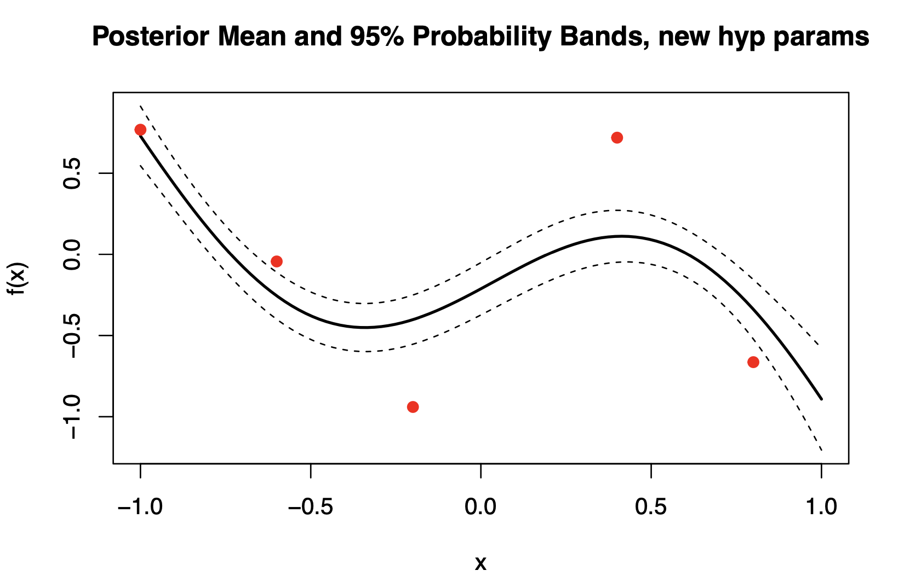
3. **GP Regression with kernlab**  
   - Use `kernlab` to fit a GP model on daily temperature data and compare hyperparameter effects.

4. **Time vs. Day Model Comparison**  
   - Compare GP models with `time` and `day` as inputs, analyzing pros and cons.
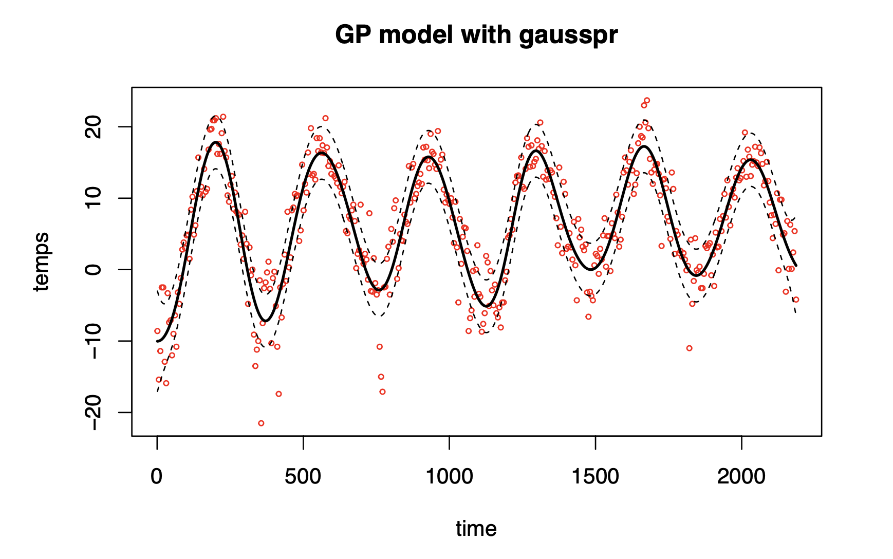
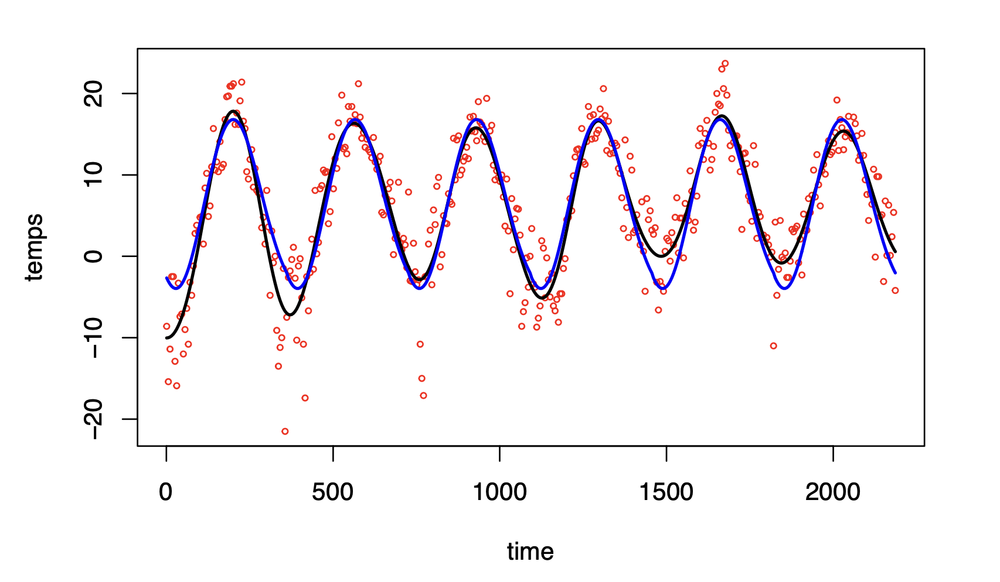
5. **Locally Periodic Kernel**  
   - Extend the GP with a periodic kernel to model seasonal patterns.
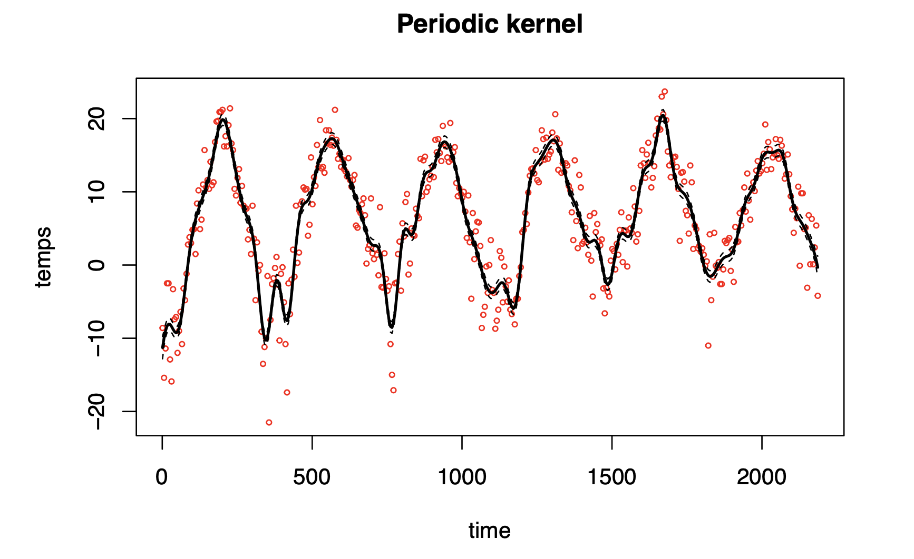

6. **GP Classification**  
   - Train a GP classification model on banknote fraud data, using two and four covariates, and compare accuracy.

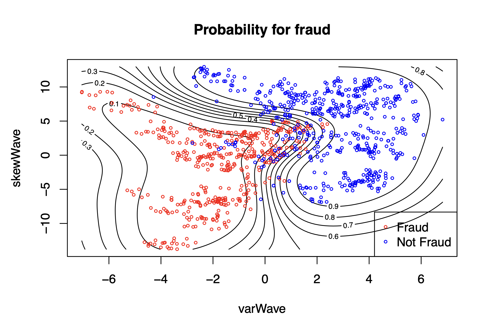
---

## Exams

The **exams** folder contains exams for practice organized by date. Each folder contains exam instructions and my solutions. Exam dates:

- **2022-10-26**
- **2023-10-25**
- **2022-08-24**
- **2021-10-25**
- **2021-11-27**
- **2020-10-27**